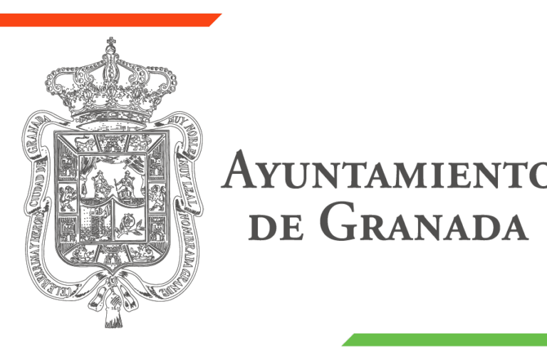

  
  <h1>Licencias Granada</h1>
  
<strong>Proyecto Social Digital para la simplificación de trámites municipales</strong>

---

## 📖 Sobre el proyecto

**Licencias Granada** es una aplicación web diseñada para ayudar al contribuyente a orientarse a la hora de tramitar licencias de obras o actividades. Dado que la información municipal suele estar distribuida en múltiples plataformas (sede electrónica, gestión unificada, páginas de orientación ciudadana), este proyecto nace para unificar y clarificar ese proceso.

Esta aplicación no sustituye a la administración, sino que sirve como una **capa de ayuda previa** con un lenguaje más claro, una estructura más comprensible y un acceso guiado a la documentación exacta que se necesita presentar antes de acudir a la ventanilla electrónica oficial.

---

## 💡 Motivación y Valor Social

¿En qué ayuda esta app? **Nace de la necesidad real del ciudadano** frente a los problemas y dudas que encuentra al intentar conseguir una licencia en su ayuntamiento:
- Incertidumbre sobre si el trámite es online o presencial.
- Confusión sobre qué documentos son obligatorios (memorias técnicas, tasación, modelos normalizados).
- Pérdida de tiempo navegando por diferentes ordenanzas.

**Licencias Granada** facilita todo el proceso proporcionando **exactamente lo que el usuario necesita** (documentos directos, modelos, requisitos y pasos a seguir), evitando confusiones y devolviendo la confianza institucional.

---

## ✨ Características Principales (Diseño UX/UI)

El diseño de la plataforma se apoya en patrones de servicios públicos, garantizando total accesibilidad:

1. **Pantalla de Inicio (Puerta de Entrada):**
   Un buscador y categorizador que permite acceder rápidamente a licencias frecuentes (Obra Menor, Obra Mayor, Actividad, etc.) usando un lenguaje sencillo y directo.
   
2. **Catálogo y Fichas de Licencia:**
   Toda la información reunida en una sola pantalla. El usuario puede ver qué presentar, descargar el modelo normalizado, revisar las tasas obligatorias y encontrar el botón exacto que le redirigirá al trámite oficial.

3. **Comparador:**
   Herramienta avanzada para enfrentar distintas licencias (por ejemplo, Obra Menor vs. Obra Mayor) y ayudar al ciudadano a decidir fácilmente cuál es el trámite correcto para su caso.

4. **Novedades y Actualizaciones:**
   Un registro que muestra qué requisitos han cambiado recientemente y cuándo fueron validados, garantizando fiabilidad y actualidad.

---

## 🛠️ Stack Técnico Propuesto

El proyecto está diseñado para lograr el equilibrio perfecto entre una interfaz moderna y un backend mantenible, apoyado en bases de datos sólidas y contenerización:

- **Frontend:** `Angular` - Interfaz modular, navegación fluida y componentes reutilizables.
- **Backend:** `Spring Boot` (Java) - Exposición de API REST, reglas de negocio y administración de fuentes de datos.
- **Base de Datos:** `PostgreSQL` / `MySQL` - Almacenamiento relacional de licencias, requisitos y registro de cambios.
- **Infraestructura:** `Docker` - Contenerización para despliegues ágiles y un entorno de desarrollo homogéneo.

---

## 📜 Créditos y Licencia

Esta carta de presentación y diseño de proyecto ha sido creada por **Jose Carlos Martin**.

Presentado como propuesta para el programa **Aircury's Summer of Code** impulsado por **Jose Carlos Martin**.

El código de este proyecto estará liberado y publicado como Open Source bajo la **Licencia MIT**. Todo el código fuente, la estructura y la documentación técnica serán desarrollados íntegramente en inglés, asegurando un mantenimiento continuo.
